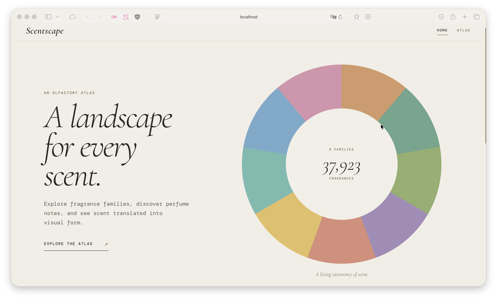
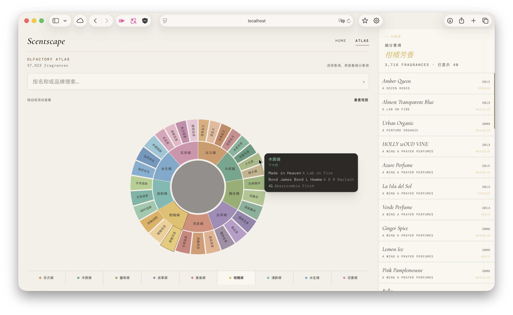
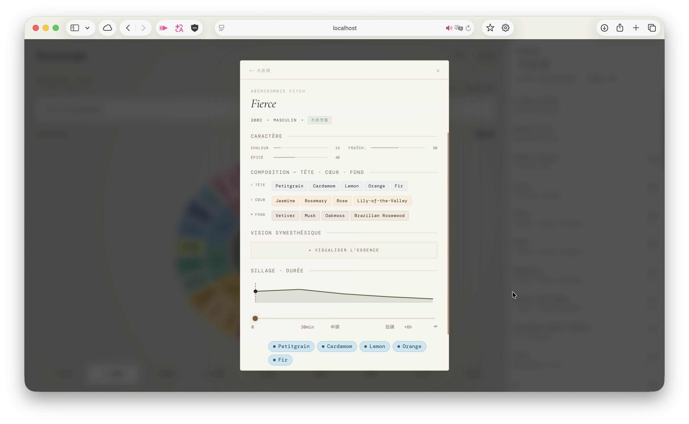
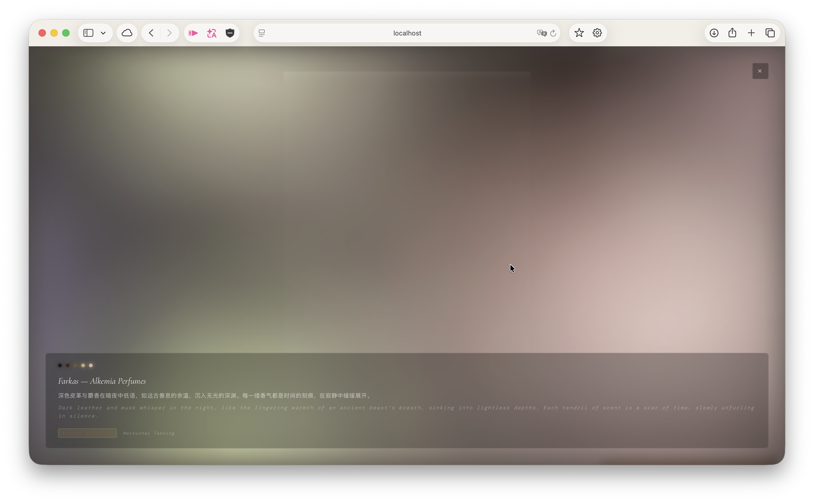
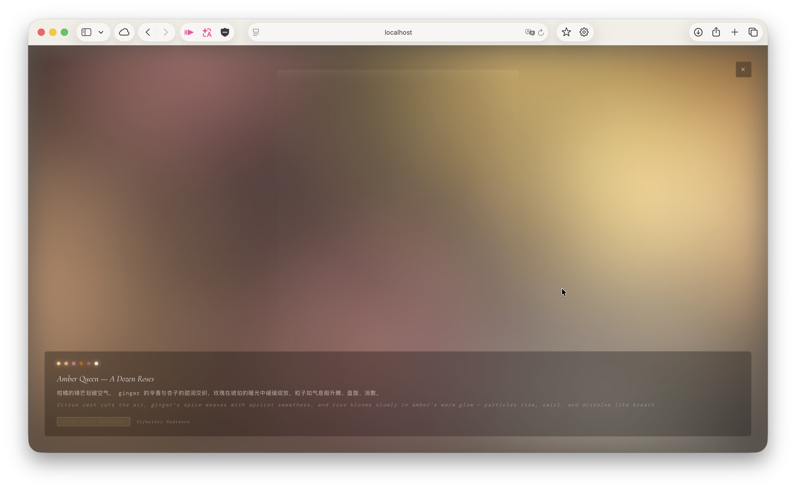

# Scentscape

AI 辅助的感官可视化界面，用香调族群、香调结构、留香时间线、情绪参数和生成式视觉来探索香水数据。

[English](README.md) | [中文](README.zh-CN.md)


*Scentscape 首页入口，展示项目理念与 9 大香调族群的整体数据分布。*

## 项目概览

Scentscape 是一个实验性的 creative technology 原型，把大规模香水数据转化为可交互的 olfactory atlas。用户可以浏览香调族群、搜索具体香水、查看香调组成，并把气味档案转译成视觉语言。

这个项目面向香水爱好者、creative technology 作品评审，以及 applied AI / interaction design 作品集场景。它没有把香水数据做成静态目录，而是把每支香水看作一个分层的感官系统：family、subfamily、top/heart/base notes、mood scores、时间中的 intensity，以及可选的 AI-generated synesthetic visual concept。

## 我的职责

- 设计 olfactory data interface 的产品概念、信息架构和视觉方向。
- 使用 Next.js / TypeScript 搭建前端，包括 fragrance wheel、搜索流程、详情面板、mood canvas 和 sillage timeline。
- 将香水数据整理并转换为 family、subfamily、mood、note-stage 和 intensity 等可交互字段。
- 实现 AI-assisted visualization routes，将香水档案转换为 JSON visual concept 和 p5.js generative sketch code。
- 使用 AI coding assistance 作为开发工作流支持，同时保持产品方向、交互决策、数据解释和最终实现审查由我主导。

## 核心功能与模块介绍

### 1. 香调族群图谱 (Atlas & Fragrance Wheel)


*Atlas 香水图谱主界面，包含 D3 交互式双层香调轮、搜索栏、族群快捷导航及右侧分页香水列表。*

- **双层交互香调轮：** 使用 D3.js 将 9 大香调主族（Oriental, Woody, Fougere, Leather, Gourmand, Citrus, Fresh, Aquatic, Floral）及细分香调（Subfamilies）渲染为双层同心圆环图谱。
- **动态悬停与筛选：** 支持鼠标悬停实时预览细分香料构成及代表香水，点击可联动右侧列表筛选该族群/细分香水。
- **实时搜索与导航：** 顶部搜索栏支持输入香水或品牌关键字进行实时匹配，底部提供快捷族群分类入口与重置视图控制。

---

### 2. 香水详情与留香时间线 (Perfume Detail & Sillage Timeline)


*香水详情弹窗，集中展现香水的元数据、气味性格、前中后调结构、AI 视觉生成入口与动态留香时间线。*

- **多维气味档案：** 集中展示品牌、发行年份、适用性别、细分香调标签及中文描述。
- **CARACTÈRE 气味性格矩阵：** 依据 Mood Scores（Chaleur 温暖、Fraîch 清新、Épicé 辛香、Obscur 阴暗、Douceur 甜美、Floral 花香）展示气味特质直方图。
- **前中后调三层结构 (Tête / Cœur / Fond)：** 明确标注前调、中调、后调的具体香料成分与视觉色彩标记。
- **动态留香时间线 (Sillage & Durée)：** 带有强度曲线 (Intensity Curve) 与交互滑块，随着时间演进（0min 喷洒 -> 30min -> 中调 -> 后调 -> 6h+）动态显隐与高亮当前活跃的香气成分。

---

### 3. AI 视觉生成 (AI Visual Generation)


*AI 视觉生成的全屏界面，展示根据香水成分生成的色彩调色板、情绪标签与文本描述。*


*针对 Amber Queen 香水生成的暖色调背景界面与气味视觉化描述。*

- **AI 气味视觉分析：** 调用 DeepSeek 模型分析香水的香料成分、留香曲线与情绪得分，生成对应的 3-5 色调调色板 (Palette)、主导情绪标签与双语文本描述。
- **动态背景 Canvas 渲染：** 使用 HTML5 Canvas 结合平滑动画算法，根据生成的色调实时渲染柔和渐变的背景图形。
- **全屏视图与重放：** 点击“VISUALISER L'ESSENCE”按钮开启全屏展示，支持查看详细颜色分布并随时重新播放生成动画。

---

### 4. 环境氛围画布 (Mood-Responsive Canvas)

- 页面底层集成 MoodCanvas 系统，根据当前选中香水的色调、密度、暖度及纹理参数（smooth, grainy, crystalline），实时平滑过渡整体背景氛围。

---

### 5. 本地数据管线 (Data Pipeline)

- 包含自动化转换脚本（`scripts/import-fragrantica.mjs`），将 CSV/XLSX 源数据清洗归一化为标准的 37,923 条 JSON 香水数据库。

## 技术栈

- **Frontend:** Next.js 16, React 19, TypeScript
- **Styling:** Tailwind CSS 4, custom CSS variables, `next/font`
- **Visualization:** D3.js, p5.js
- **Motion:** Framer Motion
- **AI:** DeepSeek chat completions，用于 visual concept generation 和 generative sketch planning
- **Data:** JSON fragrance dataset, CSV/XLSX transformation scripts

## 架构 / 工作流

```text
用户打开 Scentscape
        |
        v
FragranceWheel 渲染 family / subfamily atlas
        |
        +--> SearchBar 查询 /api/perfumes?q=
        |
        +--> Family 点击查询 /api/perfumes?family=
        |
        +--> Subfamily 点击查询 /api/perfumes?subfamily=
        |
        v
PerfumeDetail 展示 notes、mood、metadata 和 sillage
        |
        +--> MoodCanvas 更新环境背景
        |
        +--> SillageTimeline 映射时间中的 intensity
        |
        +--> AI Visualize 调用 /api/visualize/concept
                 |
                 v
              /api/visualize/render 准备经过清理的 p5.js sketch output
```

核心项目文件：

- `app/page.tsx`: 首页与核心入口。
- `app/atlas/page.tsx`: 主图谱交互界面。
- `components/FragranceWheel/`: 基于 D3 的径向香调族群可视化。
- `components/PerfumeDetail/`: family 列表、subfamily 列表、香水档案、mood bars 和 AI visualize 入口。
- `components/SillageTimeline/`: intensity curve、时间滑块和 note-stage cards。
- `components/MoodCanvas/`: 由香水视觉参数驱动的环境背景系统。
- `app/api/perfumes/route.ts`: 香水搜索、family 和 subfamily API。
- `app/api/visualize/`: AI concept 与 p5.js render-generation routes。
- `data/perfumes.json`: 应用使用的 normalized perfume dataset。
- `scripts/import-fragrantica.mjs`: CSV-to-JSON 数据转换流程。

## 项目结果

- 归一化整理了 **37,923 条香水记录**，用于交互式搜索和 family exploration。
- 实现了 9-family olfactory taxonomy，支持 subfamily filtering 和 hover previews。
- 搭建了一个结合 data visualization、sensory interaction 和 AI-assisted generative-art planning 的可运行原型。
- 将 AI visual layer 设计为可选并在客户端缓存，使核心浏览体验不依赖反复生成 AI 概念。

## 本地运行

```bash
npm install
npm run dev
```

然后打开：

```text
http://localhost:3000
```

常用开发命令：

```bash
npm run lint
npm run check:pagination
npm run build
```

如需使用 AI visualization routes，请配置：

```bash
DEEPSEEK_API_KEY=your_api_key
```

## 数据说明

香水数据集来自本地 CSV/XLSX 源材料，并被转换为应用可读取的 JSON。Family、subfamily、mood 和 intensity 字段基于 note keywords 的启发式分类，应被视为探索型界面元数据，而不是官方香水分类体系。

部分记录拥有更完整的 note-stage 数据。当前中调和后调缺失时，应用会降级为更平铺的 notes 展示。

## 当前状态

- 已实现：fragrance wheel、搜索、family/subfamily 浏览、香水详情面板、mood canvas、sillage timeline、AI concept route、AI render route 和数据导入流程。
- 待完成：公开部署链接与最终 portfolio 发布。
